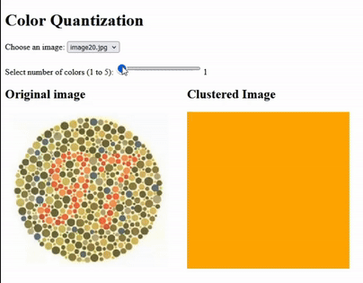

# ColorQuantization

## What is it?

**ColorQuantization** is a simple Python web application which reduces the number of colors in 20 different pictures of [Ishihara tests]("https://en.wikipedia.org/wiki/Ishihara_test"). 

The Ishihara tests are colored vision tests using specially colored pictures to diagnose color blindness. Color blind people (4.5% of the population) perceive colors differently than those with normal color vision and it is harder for them to differentiate between colors.

The pictures contain patterns made up of colored dots of various colors. People with normal color vision can identify the patterns in the images, whereas those with color blindness struggle to do so.

The web app attempts to reduce the numbers of colors in 20 such pictures and uses only basic colors instead of complex "Ishihara" ones, making the detection of numbers easier. The method used is **K-means clustering** with the **OpenCV** Python package.




## How to install

Download the zipped file from GitHub and extract to a folder (e.g. Documents). Then navigate to the folder:

```sh
cd Documents\ColorQuantization
```

Install virtualenv (if not already installed)

```sh
pip install virtualenv
```

Create the virtual environment

```sh
python -m venv myenv
```

Activate the virtual environment and install the required packages:

```sh
myenv\Scripts\activate
# Use "source myenv/bin/activate" for Linux
pip install -r requirements.txt
```


Set the environment variable for flask:

```sh
set FLASK_APP=run.py 
# Use "export FLASK_APP=run.py" for Linux
```

Run the code!

```sh
flask run
```